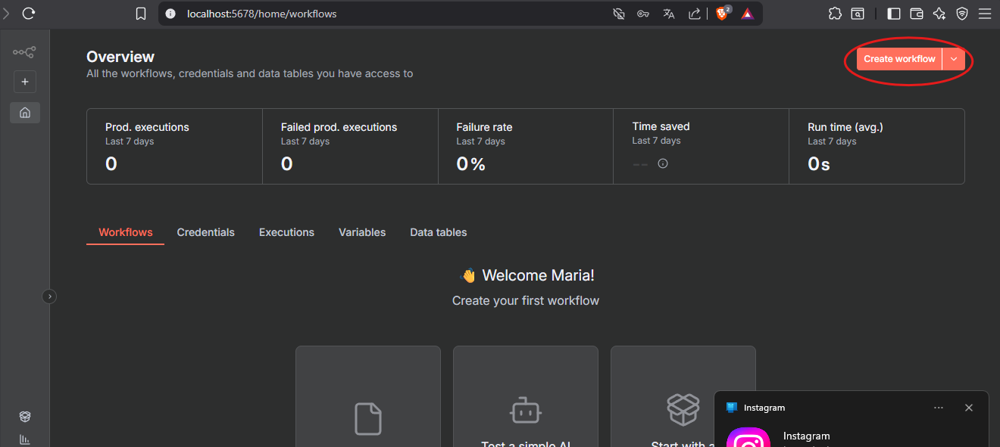

# Flujo de Trabajo de N8N e Instalación

### Instalación

Pasos para la intalación de N8N para obtener hoja de ruta personalizada.

&#x20; 1\. Abrir el buscador de windows y buscar "Terminal".

2. Al abrir la terminal escribir el comando `npm install n8n -g`
3. Epperas unos segundos y debe verse asi:

<figure><figcaption></figcaption></figure>

4. Escribe "`o`" en la terminal o accede al localhost que muestra en pantalla metiendo la url al navegador.
5. Llena los datos que te piden y crea una cuenta en n8n.
6. En la pantalla principal, selecciona el bototnde "Create workflow" ubicado en la esquina superior derecha.

<figure><figcaption></figcaption></figure>

7. A continuación, seleccionar los tres puntos ubicado en la esquina superior de la pantalla.

<figure><figcaption></figcaption></figure>

8. Ahora debes descargar el archivo que se encuentra disponible para descargar.



9. Presiona el botón "Import from File" y selecciona el archivo que descargaste, referencia:

<figure><figcaption></figcaption></figure>

10. despues de importar el archivo, selecciona el siguiente enlace:


[https://aistudio.google.com/welcome?utm\_source=PMAX\&utm\_medium=display\&utm\_campaign=FY25-global-DR-pmax-1710442\&utm\_content=pmax\&gclsrc=aw.ds\&gad\_source=1\&gad\_campaignid=22301328675\&gbraid=0AAAAACn9t65r6dBOW7HogHOd9rS6ywPzd\&gclid=CjwKCAiA\_orJBhBNEiwABkdmjKKrIZVvKttF22qhHxCU\_I9yLcbcWCWbMSCxIPVxUOesxQOsmDCo\_hoCI4cQAvD\_BwE](https://aistudio.google.com/welcome?utm_source=PMAX\&utm_medium=display\&utm_campaign=FY25-global-DR-pmax-1710442\&utm_content=pmax\&gclsrc=aw.ds\&gad_source=1\&gad_campaignid=22301328675\&gbraid=0AAAAACn9t65r6dBOW7HogHOd9rS6ywPzd\&gclid=CjwKCAiA_orJBhBNEiwABkdmjKKrIZVvKttF22qhHxCU_I9yLcbcWCWbMSCxIPVxUOesxQOsmDCo_hoCI4cQAvD_BwE)


11. Presiona "Get Started" ubicado en la esquina superior derecha, referencia:

<figure><figcaption></figcaption></figure>

12. Ahora presiona el botón "Get API Key" ubicado en la esquina inferior izquierda, referencia:

<figure><figcaption></figcaption></figure>

13. Ahora presiona el botón "" ubicado en la esquina superior derecha, referencia:

<figure><figcaption></figcaption></figure>

14. Es momento de crear un nuevo proyecto, puedes personalizar los nombres que te pida al crear un nuevo proyecto, referencia:

<figure><figcaption></figcaption></figure>

15. Ahora presiona "Crear Clave", referencia:

<figure><figcaption></figcaption></figure>

16. Copia la clave que acabas de crear, referencia:

<figure><figcaption></figcaption></figure>

17. Vuelve a la pestaña donde tienes el flujo de n8n y presiona lo siguiente, referencia:

<figure><figcaption></figcaption></figure>

18. Ahora debes darle a editar para poner la credencial que copiaste en el paso #16, referencia:

<figure><figcaption></figcaption></figure>

19. Pega la credencial que copiaste en el paso #16 y guarda con el boton naranja que dice "Save", referencia:

<figure><figcaption></figcaption></figure>

20. Después de presionar "Save" debe aparecer un mensaje de color verde, referencia:

    <figure><figcaption></figcaption></figure>
21. Ya queda actualizado, puedes cerrarlo y volver a la pestaña del flujo de n8n, referencia:

<figure><figcaption></figcaption></figure>

22. En el Flujo de trabajo ya puedes ejecutarlo, referencia:

<figure><figcaption></figcaption></figure>

23. Ahora puedes continuar en el manual de usuario [manual-de-usuario.md](manual-de-usuario.md "mention").

### Flujo de Trabajo de N8N

<figure><figcaption></figcaption></figure>
