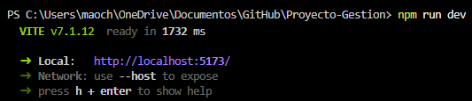
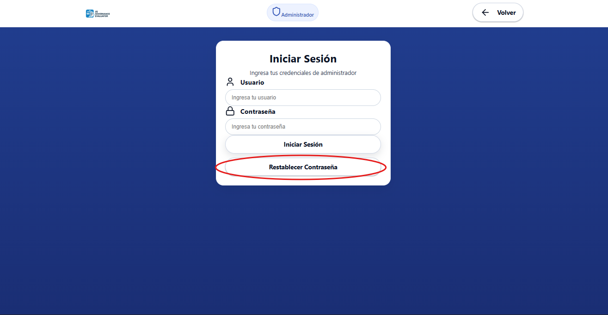

# Manual de Usuario

## Introducción

El presente manual tiene como objetivo guiar al usuario en el uso del aplicativo web “Gobernanza de IA en las Empresas”, una herramienta digital que permite realizar evaluaciones sobre la gestión ética, legal y técnica de la inteligencia artificial dentro de una organización.

El sistema genera automáticamente una hoja de ruta personalizada con recomendaciones y acciones de mejora, basadas en los resultados de la evaluación y el análisis implementado con los marcos normativos.

El sistema cuenta con dos roles principales: Organizaciones y Administrador.

### Roles del Sistema

* Organización: Representa a una empresa usuaria. Puede registrarse, iniciar sesión, realizar la evaluación de gobernanza, cargar documentación, visualizar resultados y descargar su hoja de ruta.
* Administrador: Usuario con privilegios de gestión y supervisión general. Puede registrarse, iniciar sesión, visualizar estadísticas en un dashboard descriptivo y administrar usuarios.

### Requisitos del Sistema

#### Requisitos Técnicos Mínimos:

* Navegador web actualizado (Google Chrome, Edge, Firefox o Safari).
* Conexión estable a Internet.
* Resolución mínima recomendada: 1366x768 px.
* Acceso a correo electrónico y teléfono móvil (para validación 2FA).

#### **Requisitos de Acceso:**

* Contar con un usuario registrado y verificado.
* Poseer documentos o políticas internas de IA (opcional, para carga en la evaluación).

### Acceso al Sistema

#### Ingreso al Portal

1. Descargar el repositorio en [https://github.com/AIgobernance/Proyecto-Gestion](https://github.com/AIgobernance/Proyecto-Gestion)
2. Abrir el repositorio y desplegar terminal.
3. En la terminal escribir "npm run dev"

<figure><figcaption></figcaption></figure>

4. Abrir otra pestañas en la terminal y escribir el comando "php artisan serve".

<figure><figcaption></figcaption></figure>

5. Entrar al link que proporciona la terminal.
6. Seleccionar una de las siguientes opciones:
   * **Iniciar sesión** (si ya tiene cuenta).
   * **Registrarse** (si es la primera vez que accede).
7. Seleccionar rol (Administrador o Usuario).

<figure><figcaption></figcaption></figure>

## Manual de Director de TI

### Interfaz Principal del Aplicativo

En esta sección se visualizan los marcos y se selecciona la acción a seguir.

<figure><figcaption></figcaption></figure>

### Registro de Usuario

1. Ingrese los datos de la empresa y del representante responsable.
2. Proporcione su correo electrónico y número de teléfono.
3. Recibirá un código de verificación por medio de correo electrónico (SMTP).
4. Ingrese el código en la pantalla de validación.
5. Su cuenta quedará activa y podrá iniciar sesión.

#### Formulario de Registro

<figure><figcaption></figcaption></figure>

#### Activación de Cuenta (SMTP)

<figure><figcaption></figcaption></figure>

#### Confirmación de Creación de Cuenta

<figure><figcaption></figcaption></figure>

### Inicio de Sesión

1. Diríjase a la pantalla de Inicio de sesión.
2. Ingrese su correo electrónico y contraseña.
3. Código de validación de segundo factor (2FA) por medio de correo electrónico (vía SMTP) o por SMS (vía proveedor de mensajería).
4. Accederá al panel principal del aplicativo.

#### Formulario Inicio de Sesión

<figure><figcaption></figcaption></figure>

#### Verificación en Dos Pasos (2FA)

<figure><figcaption></figcaption></figure>

#### Código de Verificación

<figure><figcaption></figcaption></figure>

#### Panel Principal

<figure><figcaption></figcaption></figure>

#### Creación de Nueva Evaluación y Acciones Rapidas

<figure><figcaption></figcaption></figure>

#### Formulario de Evaluación

#### Visualización de Resultados

#### Hoja de Ruta Personalizada

#### Historial de Evaluaciones

<figure><figcaption></figcaption></figure>

### Restablecimiento de Contraseña

<figure><figcaption></figcaption></figure>

#### Datos para Restablecimiento

#### Verificación de Doble Factor (2FA)

<figure><figcaption></figcaption></figure>

#### Código de Restablecimiento

<figure><figcaption></figcaption></figure>

#### Confirmación de Restablecimiento

<figure><figcaption></figcaption></figure>

### Flujo General de Uso

1. Iniciar sesión en la plataforma.
2. Acceder al módulo de Evaluación.
3. Completar las preguntas del formulario de gobernanza de IA.
4. Presionar el botón “Finalizar evaluación”.
5. El sistema enviará las respuestas a n8n, que coordina el análisis con una IA evaluadora.
6. La IA genera un puntaje global y una hoja de ruta personalizada.
7. El usuario puede visualizar los resultados en pantalla.
8. Descargar la hoja de ruta en formato PDF.
9. Finalmente, cerrar sesión.

### Descripción de Módulos del Sistema

#### Módulo de Registro

Permite crear una cuenta de usuario y validar la identidad mediante el sistema de doble autenticación (2FA).

* Campos requeridos: nombre, empresa, NIT, tipo de documento, numero de documento, sector, país, tamaño organizacional, correo, teléfono, contraseña.
* Mensajes automáticos de confirmación (correo o SMS).

<figure><figcaption></figcaption></figure>

#### Módulo de Inicio de Sesión

Permite acceder a la plataforma una vez el usuario está registrado y verificado.

* Permite acceso con credenciales.
* Autenticación 2FA.
* Control de acceso a módulos privados según rol (empresa o administrador).

<figure><figcaption></figcaption></figure>

#### Módulo de Evaluación

Es el núcleo del sistema.

* Presenta un formulario dinámico desarrollado en React.
* Permite subir documentos de respaldo (PDF) con un máximo de 2MB.
* Al finalizar, los datos se envían al backend Laravel → n8n → IA.

#### Módulo de Documentación

* Permite subir documentos que respalden políticas o prácticas de IA.
* Archivos válidos: <mark style="color:blue;">.pdf</mark>.
* Cada archivo se asocia a una evaluación registrada.

#### Módulo de Resultados

Muestra el resultado analizado por la IA, incluyendo:

* Puntaje de gobernanza general.
* Gráficas y visualizaciones interactivas.

#### Módulo de Hoja de Ruta

* Permite descargar el documento PDF con las recomendaciones personalizadas.
* El PDF se genera automáticamente desde la IA vía n8n y se guarda en el servidor.
* El usuario puede acceder con un botón “Descargar hoja de ruta” en la vista de resultados.

#### Modulo de Historial de Evaluaciones

Muestra las evaluaciones completadas, las pendientes, cuantas evaluaciones ha realizado, puntuación de los resultados por evaluación y promedio entre estos, ultima evaluación realizada y filtros de fecha.

<figure><figcaption></figcaption></figure>

## Manual de Administrador

### Interfaz Principal del Aplicativo

En esta sección se visualizan los marcos y se selecciona la acción a seguir.

<figure><figcaption></figcaption></figure>

### Registro de Usuario

1. Ingrese datos personales.
2. Proporcione su correo electrónico y número de teléfono.
3. Recibirá un código de verificación por medio de correo electrónico (SMTP).
4. Ingrese el código en la pantalla de validación.
5. Su cuenta quedará activa y podrá iniciar sesión.

#### Formulario de Registro

<figure><figcaption></figcaption></figure>

#### Verificación por Correo

### Inicio de Sesión

1. Diríjase a la pantalla de Inicio de sesión.
2. Ingrese su correo electrónico y contraseña.
3. Código de validación de segundo factor (2FA) por medio de correo electrónico (vía SMTP) o por SMS (vía proveedor de mensajería).
4. Accederá al panel principal del aplicativo.

#### Formulario de Inicio de Sesión

<figure><figcaption></figcaption></figure>

#### Verificación en Dos Pasos (2FA)

<figure><figcaption></figcaption></figure>

#### Código de Verificación

<figure><figcaption></figcaption></figure>

### Panel Principal

Al iniciar sesión, el Administrador accede a un **panel de control** con acceso a las siguientes opciones:

* Dashboard descriptivo con métricas globales del sistema (número de usuarios registrados, evaluaciones enviadas, tráfico de acceso, etc.).
* Gestión de usuarios (ver, editar o eliminar cuentas).
* Cerrar sesión.

#### Panel

### Restablecimiento de Contraseña

<figure><figcaption></figcaption></figure>

#### Datos para Restablecimiento

<figure><figcaption></figcaption></figure>

#### Verificación de Doble Factor (2FA)

<figure><figcaption></figcaption></figure>

#### Código de Restablecimiento

<figure><figcaption></figcaption></figure>

#### Confirmación de Restablecimiento

<figure><figcaption></figcaption></figure>

### Flujo General de Uso

* Iniciar sesión en la plataforma.
* Visualizar panel principal.
* Seleccionar opciones del panel.
* Cerrar sesión

### Descripción de Módulos del Sistema

#### Modulo de Dashboards Descriptivos

El panel presenta información visual en tiempo real sobre el uso del sistema:

* Cantidad de organizaciones registradas.
* Número total de evaluaciones completadas.
* Estado de autenticaciones 2FA (por correo o SMS).
* Actividad general de los usuarios.

#### Modulo de Administración de Usuarios

* El administrador puede ver el listado completo de organizaciones registradas.
* Puede editar información básica (estado, correo, tipo de autenticación).
* Puede eliminar usuarios inactivos o duplicados.
* Cada modificación queda registrada en la base de datos.

## Seguridad y Autenticación

El aplicativo emplea autenticación 2FA (autenticación de doble factor) para reforzar la seguridad de las cuentas, permitiendo al usuario elegir entre:

* Código enviado por correo electrónico (SMTP).
* Código enviado por SMS.

#### Verificación en Dos Pasos (2FA)

<figure><figcaption></figcaption></figure>

#### Código de Verificación

<figure><figcaption></figcaption></figure>

## Recomendaciones Generales

### **Para las Organizaciones:**

* Mantenga su información empresarial actualizada.
* Guarde sus hojas de ruta descargadas para seguimiento.
* Verifique los canales 2FA configurados antes de iniciar sesión.

### **Para el Administrador:**

* Supervise el número de usuarios activos y registros nuevos.
* Mantenga la base de datos y el servidor de autenticación actualizados.
* Use el dashboard para analizar el crecimiento del uso del sistema.

## Soporte Técnico

Para consultas o asistencia:

<mark style="color:blue;">pgestionti@gmail.com</mark>\
